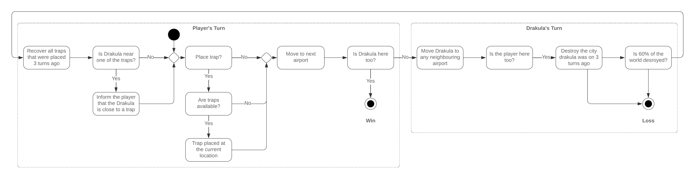

# drakula

A third-person single-player strategic vampire hunting game
loosely inspired by [Fury Of Dracula (Third/Fourth Edition)](https://boardgamegeek.com/boardgame/181279/fury-of-dracula-thirdfourth-edition).

## Installation

1. Clone the repository `git clone github.com/ktnlvr/drakula`
2. Enter the directory `cd drakula`
3. Install all the required packages using `pip install -r requirements.txt`
4. Install the module using `pip install -e .`
5. Run with `python -m drakula`

## Game Loop

## Introduction

This document is meant for internal reference and public display. It contains information about both the requirements
to the product, and a listing of specific design decisions taken in the making of the game.

* [Vision](#vision)
  * [Inspiration](#inspiration)
  * [Theme](#theme)
  * [Goals](#goals)
  * [User Skills](#user-skills)
  * [Game Mechanics](#game-mechanics)
  * [Progression and Challenge](#progression-and-challenge)
  * [Loss and Win Conditions](#loss-and-win-conditions)
  * [Graphic Design](#graphic-design)
* [Functional Requirements](#functional-requirements)
  * [Target Platforms](#target-platforms)
  * [Configuration](#configuration)
* [Quality Requirements](#quality-requirements)
  * [Age Category](#age-category)
  * [Legal](#legal)

## Vision

Count Dracula is a powerful vampire lord on a mission to destroy the human race. He has began wreaking havoc all around the world. The player will attempt to bring the might Count down, by trapping the airports and catching the vampire to end the chaos once and for all.

### Inspiration

The conceptual idea of travelling to hunt down Dracula is taken from the boardgame Fury Of Dracula. However, to avoid plagiarism, none of the programmers involved are informed about the specific rules, mechanics or other game components.

### Theme

Like the inspiration, the game centers on the mighty Dracula going around the world.

### Goals

Providing entertainment is the main design goal. Akin to other session games, it should be easy to run, play a couple of games and then exit.

### User Skills

The game is focused on testing the player's ability to strategize, handle resources, deal with hidden information and type on a keyboard.

### Loss and Win Conditions

The player wins if they can defeat Dracula. This is done by landing on the same airport as him and initiating combat. This can happen unintentionally, if on the Count's turn he moves to the player's airport or intentionally, if the player

### Game Mechanics

Since the main topic is flight, the main mechanic is flying.
The player is tasked with capturing Dracula. This is done by trapping an airport and waiting for Dracula to land in the trap.

This would be easy lest the position of the count was known. During the entire game, the actual position is never communicated explicitly.

The game loop is separated into turns. On their turn, the player chooses a location to fly to and optionally installs a
trap in the current airport.

When due to the player's or Dracula's move both end up on the same airport a battle ensues. If the airport was previously trapped, 

### Progression and Challenge

### Graphic Design

## Functional Requirements

As a player, I can move between airports in alignment with my understanding of the current position of the Count. This is the key element of strategy, since I can move towards or away from the Dracula depending on my preparation.

As a player, I can "trap" and airport using my CURRENCY_NAME. If Dracula lands on a trapped airport, I am instantly informed about it. The Dracula can't move for PERIOD_OF_TIME, so I can go towards his airport and catch him.

As Dracula, my movement is guided by logic and rules. I can not cross a flightway if I already crossed it and I have other options. So if, say, I am at Lisbon and it has a flight to 

As Dracula, I destroy cities in my way. When I land on an airport, a timer of CITY_DESTROY_TIME starts. When the timer is elapsed, the city is erased off the map. However, if the player lands on a city that is about to be destroyed, it is saved and the player is informed how long ago I was here.

The player can save and restore their progress to pick up a game later.

### Target Platforms

It is imperative that the game can run on `Linux` and `Windows 10/11` devices.

The recommended system requirements are as follows:
* 64 or 32-bit processor and an operating system.
* Windows 10 (64 or 32-bit), Windows 11, Linux (6.1.X)
* AMD FX-4300 (4 * 3800) or equivalent / Intel Core i3-3240 (2 * 3400) or equivalent
* 2 GB RAM
* Radeon HD 7750 (1024 VRAM) or equivalent / GeForce GT640 (2048 VRAM) or equivalent
* 2 GB of storage space

While minor improvements to adapt the code for other platforms can be done, they are not a priority.

The target Python version is 3.9, with all the subsequent Python3.X versions following as per Python's major
version compatibility policy.

All the dependencies are listed in the [`requirements.txt`](./requirements.txt) and should run as per their own compatibility policy.

The product also requires an active and running and accessible instance of MariaDB. The credentials, as well as the
port and the host should be configured following the [Configuration](#configuration) section.

### Configuration

Configuration is done via environmental variables. They can be both fetched from and environment and a `.env` file.
For more examples see [`example.env`](./example.env).

## Quality Requirements

### Age Category

The game should be appropriate for players of age 12 and more. As a guideline, the [PEGI 12](https://pegi.info/what-do-the-labels-mean) rating is used.

> Video games that show violence of a slightly more graphic nature towards fantasy characters or non-realistic violence towards human-like characters would fall in this age category. Sexual innuendo or sexual posturing can be present, while any bad language in this category must be mild.

In practice, this requirement is not difficult to satisfy. Since conceptually the game does not rely on violence or blood,
no additional effort was needed to satisfy the criteria above.

### Legal

All of the assets used in game must be distributed under a public domain license by a third party or produced in house
following the licensing requirements of the active license (see [`LICENSE.txt`](./LICENSE.txt)).
